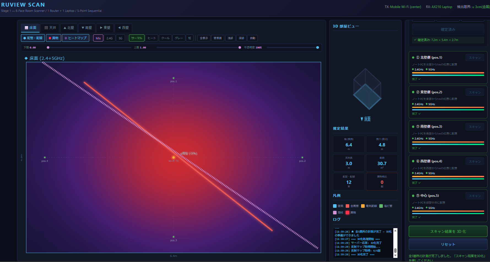

**Wi-Fi CSI 壁面透視スキャナ — 6 面同時可視化 / 深度スライダー式構造探査 / 異物(盗聴器)検出**

> 1 台のモバイル Wi-Fi ルーター + 1 台のノート PC で、部屋の壁・床・天井の **内部構造** を非接触で透視する。


<!-- スクリーンショットを追加する場合 -->
<!--  -->

---

## 動作原理

### CSI (Channel State Information) とは

Wi-Fi フレームの各サブキャリアに対する複素チャネル応答 $H(f_k)$ を取得する技術。振幅はパス損失・反射強度を、位相は伝搬遅延（ToF）を含む。Intel AX210 + [PicoScenes](https://ps.zpj.io/) で 100 Hz サンプリング可能。

### マルチパス反射モデル

チャネル応答は以下のマルチパス合成で表現される:

$$H(f_k) = \sum_{n=0}^{N-1} \alpha_n \cdot e^{-j2\pi f_k \tau_n}$$

| 記号 | 意味 |
|------|-----|
| $\alpha_n$ | 第 n パスの複素振幅（反射材質で変化） |
| $\tau_n$ | 第 n パスの伝搬遅延 = 距離 / 光速 |
| $f_k$ | 第 k サブキャリア周波数 |

壁内の金属管・電気配線・塩ビ管はそれぞれ反射率が異なり、$\alpha_n$ の大きさから材質を推定できる。

### 測定方式: 5 点シーケンシャル

```
        北壁
    ┌─────────────┐
    │     ① (北)  │
    │             │
 西 │④      ⑤    │② 東
    │      (中心) │
    │     ③ (南)  │
    └─────────────┘
        南壁

TX: モバイルWi-Fi (部屋中心, 固定)
RX: ノートPC (①→②→③→④→⑤ 移動)
```

各ポイントで 2.4 GHz (ch1, 40 MHz, 114 sc) + 5 GHz (ch36, 80 MHz, 234 sc) を各 30 秒収集。距離分解能:

| バンド | 帯域幅 | 理論分解能 $c / (2 \cdot BW)$ |
|--------|--------|------------------------------|
| 2.4 GHz | 40 MHz | 3.75 m |
| 5 GHz | 80 MHz | **1.875 m** |

5 GHz が主要推定帯域、2.4 GHz は壁透過性が高いため補完に使用。

---

## システムアーキテクチャ

```
┌──────────────┐     ┌───────────────────────────────────────────┐
│  Browser UI  │◄────►  FastAPI Server (uvicorn, port 8080)     │
│  (6面ビュー) │ WS  │                                           │
└──────────────┘     │  routes.py ── REST API (19 endpoints)     │
                     │  ws.py ───── WebSocket /ws/scan           │
                     │                                           │
                     │  ┌─── CSI Layer ────────────────────┐     │
                     │  │ adapter.py   PicoScenes / Sim     │     │
                     │  │ collector.py DualBandCollector     │     │
                     │  │ calibration.py PhaseCalibrator     │     │
                     │  │ models.py    CSIFrame / Session    │     │
                     │  └──────────────────────────────────┘     │
                     │  ┌─── Scan Layer ───────────────────┐     │
                     │  │ tof_estimator.py   MUSIC / ESPRIT │     │
                     │  │ aoa_estimator.py   (Phase C)      │     │
                     │  │ room_estimator.py  壁距離推定      │     │
                     │  │ reflection_map.py  CSI振幅→6面グリ │     │
                     │  │                   ッドマッピング   │     │
                     │  │ structure_detector.py 配管検出     │     │
                     │  │ foreign_detector.py  異物検出      │     │
                     │  └──────────────────────────────────┘     │
                     │  ┌─── Fusion / RF ──────────────────┐     │
                     │  │ band_merger.py   2.4+5GHz統合     │     │
                     │  │ spatial_integrator.py 5点統合      │     │
                     │  │ view_generator.py 6面データ生成    │     │
                     │  │ scanner.py  パッシブRFスキャン      │     │
                     │  │ device_classifier.py デバイス分類  │     │
                     │  └──────────────────────────────────┘     │
                     └───────────────────────────────────────────┘
```

---

## 処理パイプライン

```
CSIFrame収集 (5点×2バンド)
    │
    ├─ PhaseCalibrator: 位相校正 (STO/CPE 推定除去)
    │
    ▼
ToFEstimator (MUSIC 超解像)
    │   MUSIC空間スペクトラム → パス距離 + 振幅
    │
    ├───────────────────┐
    ▼                   ▼
RoomEstimator      ReflectionMapGenerator
(鏡像法逆変換)      ──── Phase B 改修 ────
    │               CSI振幅を各面グリッド
    ▼               (0.05 m) に直接マッピング
RoomDimensions     ガウス重み付き空間補間
(手動入力 80% +    正規化 0.0–1.0 出力
 ToF 20% 融合)         │
                        ▼
                   6×ReflectionMap
                   (正規化グリッド)
                        │
                   ┌────┴────┐
                   ▼         ▼
              StructureDetector   → ブラウザ UI
              (連結成分解析)         深度スライダーで
              (UIデフォルトOFF)      閾値範囲を指定し
                                    Canvas リアルタイム描画
```

### 反射マップ生成 (Phase B 方式)

Phase B で `reflection_map.py` を全面書き換え。従来の「既知座標投影 / 逆投影法」を廃止し、CSI 振幅を各面のグリッドセルへ直接マッピングする方式に変更した。

処理フロー:

1. **CSI 振幅抽出**: 5 測定点 × 2 バンドの全 CSIFrame から振幅ベクトルを取得し、平均振幅を算出
2. **面グリッド構築**: 各面 (floor/ceiling/north/south/east/west) に対し `grid_resolution` (デフォルト 0.05 m) のグリッドを生成
3. **ガウス重み付き空間補間**: 各測定点から面への投影位置を基点とし、ガウス関数 (`spread_sigma_m`) で重み付けた振幅値を空間全体に分配
4. **正規化**: 全セルを 0.0–1.0 に正規化
5. **ガウシアン平滑化**: `gaussian_sigma` でフィルタリングし、スムーズなヒートマップを出力

利点: 既知座標のカンニングがなくなり、実機データにそのまま適用可能。深度スライダーと組み合わせることで、ユーザーが反射強度の表示範囲を自由に調整できる。

### ToF 推定: MUSIC 超解像

```python
# 空間相関行列の固有値分解
Rxx = (1/K) Σ x(k) x(k)^H     # K: スナップショット数
Rxx = U Λ U^H                  # 固有値分解
# 雑音部分空間
Un = U[:, n_paths:]
# MUSIC スペクトラム
P(τ) = 1 / |a(τ)^H Un Un^H a(τ)|
# a(τ) = [1, e^{-j2πΔfτ}, ..., e^{-j2π(M-1)Δfτ}]^T
```

### 部屋寸法推定: 鏡像法逆変換

壁反射パスの距離から壁距離を逆算:

$$d_{wall} = \frac{\sqrt{d_{reflection}^2 - d_{direct}^2}}{2}$$

手動入力値がある場合は 80/20 融合:
$d_{fused} = 0.8 \cdot d_{manual} + 0.2 \cdot d_{ToF}$

### 材質分類閾値

| 材質 | 反射強度 | 閾値 |
|------|---------|------|
| 金属管 (鋼管, 銅管) | 高 | ≥ 0.6 |
| 間柱 (木/軽鉄) | 中高 | 0.45–0.6 |
| 電気配線 (VVF) | 中 | 0.35–0.45 |
| 塩ビ管 (VP/VU) | 低 | 0.35–0.45 |

---

## UI 機能 (Phase B+ 実装)

### 深度スライダー (CTスキャン方式)

壁内の反射強度を深度に見立て、ユーザーがスライダーで表示範囲を調整する。

- **下限スライダー** (0–100): この値以下の反射強度を非表示
- **上限スライダー** (0–100): この値以上の反射強度を非表示
- **不透明度スライダー** (0–100): ヒートマップ全体の透明度を調整

各面 (6タブ) ごとにスライダー値を独立保持。タブ切替時に自動保存・復元される。

### プリセットボタン

| プリセット | 下限 | 上限 | 用途 |
|-----------|------|------|------|
| 全表示 | 0 | 100 | 全反射強度を表示 |
| 壁表面 | 0 | 30 | 壁直近の弱い反射を表示 |
| 浅部 | 30 | 65 | 壁内浅部の構造を強調 |
| 深部 | 65 | 100 | 壁奥の金属管等を強調 |
| 自動 | (自動算出) | (自動算出) | ピーク値 ± 20% に自動設定 |

### カラーマップ切替

5 種類のカラーマップを即時切替:

| ID | 名称 | 用途 |
|----|------|------|
| thermal | サーマル | デフォルト。青→紫→マゼンタ→赤→オレンジ |
| heat | ヒート | 黒→赤→黄→白。高コントラスト |
| cool | クール | 黒→青→シアン→白。配線に最適 |
| grayscale | グレー | 白黒。印刷・PDF用 |
| rainbow | 虹 | 虹色全域。細かい強度差を視認 |

### マウスホバーツールチップ

Canvas 上にマウスを置くと、その位置の座標 (m) と反射強度値 (0.00–1.00) をリアルタイム表示。

### フィルター・周波数切替

- **フィルターボタン**: 配管・配線 (デフォルトOFF) / 異物 / ヒートマップ を独立ON/OFF
- **周波数切替**: Mix (2.4+5 GHz 統合) / 2.4 GHz 単独 / 5 GHz 単独 → 切替時にサーバーから該当バンドのグリッドデータを再取得

---

## ディレクトリ構成

```
ruview-scan/
├── config/
│   └── default.yaml ........... 測定パラメータ, 解析設定, スライダーデフォルト値
├── src/
│   ├── main.py ................ CLI (click): --simulate, --host, --port
│   ├── config.py .............. YAML → AppConfig (pydantic)
│   ├── errors.py .............. 例外階層 (RuViewError → 7サブクラス)
│   ├── api/
│   │   ├── server.py .......... AppState (シングルトン), FastAPI app
│   │   ├── routes.py .......... REST 19 endpoints, /build 融合ロジック,
│   │   │                        /result/map/{face}/{band} グリッドAPI
│   │   └── ws.py .............. WebSocket 進捗ストリーム
│   ├── csi/
│   │   ├── models.py .......... CSIFrame, DualBandCapture, ScanSession
│   │   ├── adapter.py ......... CSIAdapter ABC, PicoScenesAdapter, SimulatedAdapter
│   │   ├── collector.py ....... DualBandCollector (バンド切替 + 収集)
│   │   └── calibration.py ..... PhaseCalibrator (STO/CPE 補正)
│   ├── scan/
│   │   ├── scan_manager.py .... セッション管理 + 進捗コールバック
│   │   ├── tof_estimator.py ... MUSIC / ESPRIT / IFFT (超解像 ToF)
│   │   ├── aoa_estimator.py ... AoA 推定 (Phase C 統合予定)
│   │   ├── room_estimator.py .. 5点ToF → 鏡像法逆変換 → RoomDimensions
│   │   ├── reflection_map.py .. ★ CSI振幅→6面グリッド直接マッピング (Phase B)
│   │   ├── structure_detector.py  連結成分 → 配管/配線判定 (UI非表示)
│   │   └── foreign_detector.py .. RF+CSI残差 → 不審デバイス検出
│   ├── fusion/
│   │   ├── band_merger.py ..... 2.4+5GHz ヒートマップ加重統合
│   │   ├── spatial_integrator.py  5点の寄与を距離重み統合
│   │   └── view_generator.py .. 6面 JSON + Canvas 座標変換
│   ├── rf/
│   │   ├── scanner.py ......... iw パッシブスキャン (ch→freq全帯域対応)
│   │   └── device_classifier.py  OUI, RSSI, beacon → デバイス分類
│   └── utils/
│       ├── math_utils.py ...... MUSIC, ESPRIT, 相関行列
│       └── geo_utils.py ....... channel_to_freq, project_to_wall, 鏡像法
├── static/
│   ├── index.html ............. 3カラムレイアウト (6面ビュー, 3D, 計測制御)
│   │                            深度スライダー, カラーマップ切替, プリセット
│   ├── css/style.css .......... ダークテーマ UI, スライダー/プリセット/カラーマップ用CSS
│   └── js/
│       ├── app.js ............. メインモジュール: グリッドデータ取得, スライダー連動,
│       │                        カラーマップ/不透明度/プリセット管理, ホバーツールチップ
│       ├── scan_control.js .... 5点スキャン制御 + SIM フォールバック
│       ├── websocket.js ....... WS 接続 + 自動再接続
│       ├── heatmap_renderer.js  ★ drawGrid() サーバーグリッド描画 (5カラーマップ対応),
│       │                        drawLegacy() 旧方式フォールバック,
│       │                        calcHistogram(), probeGrid()
│       ├── floor_renderer.js .. 配管/異物/計測点 Canvas 描画
│       ├── room3d.js .......... アイソメ 3D 部屋ビュー
│       └── audio.js ........... 異物検出アラート音
├── docs/
│   └── images/ ................ スクリーンショット格納用
├── ruview.bat ................. Windows 起動スクリプト
├── ruview.sh .................. Linux 起動 (monitor mode 自動設定)
└── requirements.txt
```

---

## セットアップ

### 必要機材

| 機材 | 要件 | 用途 |
|------|------|------|
| モバイル Wi-Fi | 2.4 + 5 GHz デュアルバンド | TX (部屋中心に固定) |
| ノート PC | Intel AX210/AX211 搭載 | RX (5箇所移動) |
| OS | Kali Linux 2024+ / Windows 10+ | 実機: Kali, シミュレーション: 任意 |

### インストール

```bash
cd ruview-scan
python3 -m venv venv
source venv/bin/activate          # Windows: venv\Scripts\activate
pip install -r requirements.txt

# 実機のみ: PicoScenes インストールが必要
# → https://ps.zpj.io/
```

### 起動

```bash
# シミュレーション (物理ベース CSI 生成)
ruview.bat --simulate              # Windows
bash ruview.sh --simulate          # Linux

# 実機 (PicoScenes + monitor mode)
sudo bash ruview.sh
```

→ ブラウザで **http://127.0.0.1:8080** にアクセス

---

## 使い方

1. **部屋寸法を入力** — 幅(東西)・奥行(南北)・天井高をメジャーで測定し入力 → 「寸法を確定」
2. **モバイル Wi-Fi を部屋中心に設置**
3. **5 箇所を順次スキャン** — 各壁から 1m の位置にノート PC を配置 → 「スキャン」  
   (各ポイント: 2.4 GHz 30 秒 + 5 GHz 30 秒 = 約 1 分)
4. **「スキャン結果を 3D 化」** を実行
5. **深度スライダーで壁内部を探索**:
   - 下限・上限スライダーを動かし、反射強度の表示範囲を絞り込む
   - プリセット (壁表面 / 浅部 / 深部 / 自動) で素早く切替
   - カラーマップを変更して視認性を調整
   - マウスホバーで任意地点の座標・強度値を確認
6. **6 面タブ切替** で各面を確認 — 各面のスライダー設定は独立保持

---

## API リファレンス

### REST Endpoints

| Endpoint | Method | 説明 | パラメータ |
|----------|--------|------|-----------|
| `/api/health` | GET | ヘルスチェック | — |
| `/api/session/create` | POST | セッション作成 | — |
| `/api/scan/{point_id}/start` | POST | スキャン開始 | point_id: north/east/south/west/center |
| `/api/scan/{point_id}/status` | GET | ポイント別状態 | — |
| `/api/scan/status` | GET | 全体状態 | — |
| `/api/build` | POST | 3D 化実行 | `?manual_width=&manual_depth=&manual_height=` (Optional) |
| `/api/result/room` | GET | 推定部屋寸法 | — |
| `/api/result/map/{face}/{band}` | GET | 面別反射マップ (グリッドデータ) | face: floor/ceiling/north/south/east/west, band: mix/24/5 |
| `/api/result/structures` | GET | 検出構造物リスト | — |
| `/api/result/foreign` | GET | 異物情報 | — |
| `/api/reset` | POST | セッションリセット | — |

### WebSocket

| Endpoint | 方向 | メッセージ type |
|----------|------|----------------|
| `/ws/scan` | Server→Client | `status`, `progress`, `scan_complete`, `error` |
| `/ws/scan` | Client→Server | `{action: "start_scan", point_id: "north"}` |

---

## シミュレーションモード

`--simulate` フラグで物理ベース CSI シミュレーションが起動する。

### `SimulatedAdapter` の仕組み

1. **鏡像法 (Image Source Method)** で壁反射経路を計算:
   - 4 壁 + 天井 + 床 = 6 鏡像ルーター
   - 各鏡像からの距離 → ToF

2. **配管散乱体** をシミュレーション:
   - 金属管, 電気配線, 塩ビ管, 間柱の 3D 座標を定義
   - 散乱体までの距離 + 材質別反射率 → $\alpha_n$

3. **サブキャリアごとの複素チャネル応答**:
   ```
   H(f_k) = Σ α_n · exp(-j·2π·f_k·τ_n) + noise
   ```
   → 位相・振幅が周波数選択性フェージングを再現

4. `set_point()` で計測点切替: 計測点の位置に応じてマルチパス構造が変化

---

## 設計思想

- **CTスキャン方式の壁内探査** — CSI 振幅を深度に見立て、スライダーで反射強度範囲を絞り込むことにより壁表面から深部まで層ごとに構造を可視化。医療 CT のウィンドウ調整に着想を得た操作性
- **「部屋の外形は人間が測り、壁の中身は CSI が透視する」** — 80 MHz 帯域幅での距離分解能は 1.875 m。部屋寸法推定には不十分だが、壁内の反射パターン解析には十分
- **シミュレーション / 実機の自動切替** — `SimulatedAdapter` の MAC アドレス (`AA:BB:CC:DD:EE:FF`) で判定
- **TSCM (Technical Surveillance Countermeasures) 対応** — RF パッシブスキャンと CSI 残差解析を組み合わせて盗聴器等の不審デバイスを検出

---

## 変更履歴

### Phase A (完了)
- CSI 取得・ToF 推定・基本 UI 実装
- buildResult フリーズ修正、手動寸法ハンドリング、エラーログ改善
- SimulatedAdapter による反射マップシミュレーション

### Phase B (完了)
- `reflection_map.py` 全面書き換え: 逆投影/既知座標カンニング → CSI 振幅直接マッピング
- 深度スライダー (下限・上限) を UI に追加
- `/api/result/map/{face}/{band}` グリッドデータ API 追加
- `heatmap_renderer.js` → サーバーグリッド描画方式 (`drawGrid`) に変更

### Phase B+ (完了)
- 5 種カラーマップ切替 (サーマル/ヒート/クール/グレー/虹)
- 不透明度スライダー
- プリセットボタン (全表示/壁表面/浅部/深部/自動)
- マウスホバーツールチップ (座標 + 反射強度値)
- Canvas ストレッチフィル (全面フル表示、アスペクト比非固定)
- 配管自動描画をデフォルト OFF 化

---

## ロードマップ

| Phase | 内容 | 状態 |
|-------|------|------|
| **A** | CSI 取得, ToF 推定, 基本 UI | ✅ 完了 |
| **B** | CSI 振幅直接マッピング, 深度スライダー | ✅ 完了 |
| **B+** | カラーマップ, 不透明度, プリセット, ホバーツールチップ | ✅ 完了 |
| **C** | 異物検出精度向上, RF パッシブスキャン | 🔧 予定 |
| **D** | 160 MHz 対応 (≈0.94 m 分解能), 追加測定点 | 🔧 予定 |
| **E** | 3D ビュー (Three.js), PDF/CSV レポート出力 | 🔧 予定 |
| **F** | 実機キャリブレーション, AoA 統合, DI パターン | 🔧 予定 |

---

## ライセンス

Private — 無断転載・複製禁止
'@
$filePath = "F:\Antigravity_tool\RuView Scan\ruview-scan\README.md"
Set-Content -Path $filePath -Value $content -Encoding UTF8
Write-Host "README.md written ($((Get-Content $filePath).Count) lines)" -ForegroundColor Green
```

### 主な変更点

| セクション | 変更内容 |
|-----------|---------|
| タイトル | 「深度スライダー式構造探査」に変更 |
| 処理パイプライン | ReflectionMapGenerator の説明を CSI 振幅直接マッピングに更新 |
| 反射マップ生成 | Phase B 方式の詳細セクションを新設 |
| UI 機能 | **新規セクション** — 深度スライダー、プリセット、カラーマップ、不透明度、ホバーツールチップ |
| API | `/api/result/map/{face}/{band}` を追加 |
| ディレクトリ構成 | reflection_map.py, heatmap_renderer.js, app.js の説明を更新、docs/images/ 追加 |
| 使い方 | ステップ5-6にスライダー操作手順を追加 |
| 設計思想 | 「CTスキャン方式」の説明を追加 |
| 変更履歴 | **新規セクション** — Phase A / B / B+ の実績 |
| ロードマップ | Phase B/B+ を完了マーク、C-F を再編 |
