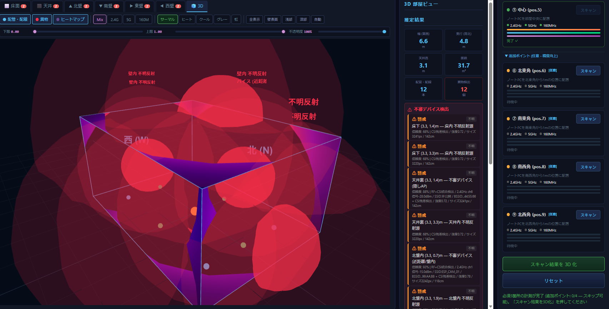
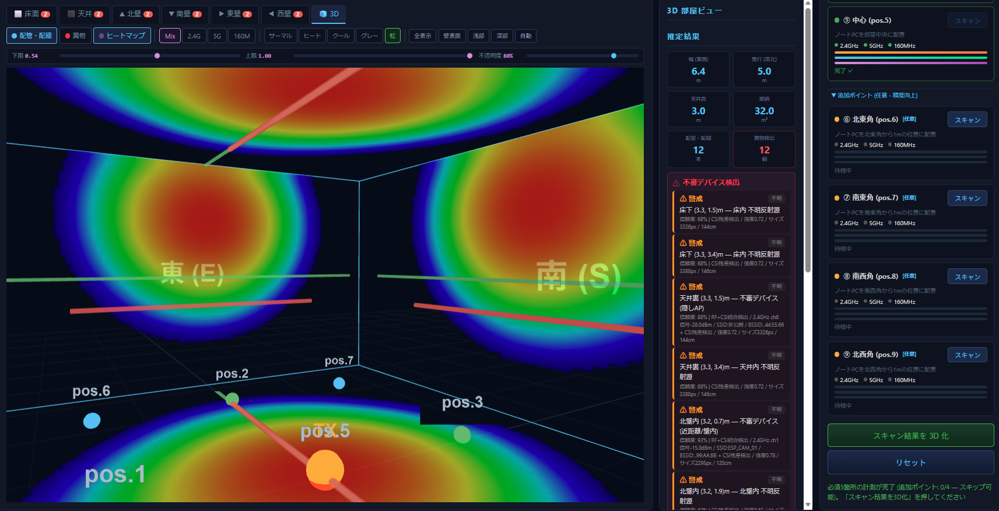

**Wi-Fi CSI 壁面透視スキャナ — 6 面同時可視化 / 深度スライダー式構造探査 / 異物(盗聴器)検出**

> 1 台のモバイル Wi-Fi ルーター + 1 台のノート PC で、部屋の壁・床・天井の **内部構造** を非接触で透視する。


<!-- スクリーンショットを追加する場合 -->
<!--  -->

---

## 動作原理

### CSI (Channel State Information) とは

Wi-Fi フレームの各サブキャリアに対する複素チャネル応答 $H(f_k)$ を取得する技術。振幅はパス損失・反射強度を、位相は伝搬遅延（ToF）を含む。Intel AX210 + [PicoScenes](https://ps.zpj.io/) で 100 Hz サンプリング可能。

### マルチパス反射モデル

チャネル応答は以下のマルチパス合成で表現される:

$$H(f_k) = \sum_{n=0}^{N-1} \alpha_n \cdot e^{-j2\pi f_k \tau_n}$$

| 記号 | 意味 |
|------|-----|
| $\alpha_n$ | 第 n パスの複素振幅（反射材質で変化） |
| $\tau_n$ | 第 n パスの伝搬遅延 = 距離 / 光速 |
| $f_k$ | 第 k サブキャリア周波数 |

壁内の金属管・電気配線・塩ビ管はそれぞれ反射率が異なり、$\alpha_n$ の大きさから材質を推定できる。

### 測定方式: 9 点シーケンシャル (5 必須 + 4 オプション)

```
          北壁
    ┌─────────────────┐
    │⑨(NW)  ①(N)  ⑥(NE)│
    │                 │
 西 │④(W)    ⑤     ②(E)│ 東
    │       (中心)    │
    │⑧(SW)  ③(S)  ⑦(SE)│
    └─────────────────┘
          南壁

TX: モバイルWi-Fi (部屋中心, 固定)
RX: ノートPC (①→②→③→④→⑤ 必須, ⑥→⑦→⑧→⑨ 任意)
```

各ポイントで 2.4 GHz (ch1, 40 MHz, 114 sc) + 5 GHz (ch36, 80 MHz, 234 sc) + 5 GHz (ch36, 160 MHz, 468 sc) を各 30 秒収集。距離分解能:

| バンド | 帯域幅 | 理論分解能 $c / (2 \cdot BW)$ |
|--------|--------|------------------------------|
| 2.4 GHz | 40 MHz | 3.75 m |
| 5 GHz | 80 MHz | 1.875 m |
| 5 GHz | 160 MHz | **≈ 0.94 m** |

160 MHz が最高分解能帯域、80 MHz が主要推定帯域、2.4 GHz は壁透過性が高いため補完に使用。

---

## システムアーキテクチャ

```
┌──────────────┐     ┌───────────────────────────────────────────┐
│  Browser UI  │◄────►  FastAPI Server (uvicorn, port 8080)     │
│  (6面ビュー) │ WS  │                                           │
└──────────────┘     │  routes.py ── REST API (19 endpoints)     │
                     │  ws.py ───── WebSocket /ws/scan           │
                     │                                           │
                     │  ┌─── CSI Layer ────────────────────┐     │
                     │  │ adapter.py   PicoScenes / Sim     │     │
                     │  │ collector.py DualBandCollector     │     │
                     │  │ calibration.py PhaseCalibrator     │     │
                     │  │ models.py    CSIFrame / Session    │     │
                     │  └──────────────────────────────────┘     │
                     │  ┌─── Scan Layer ───────────────────┐     │
                     │  │ tof_estimator.py   MUSIC / ESPRIT │     │
                     │  │ aoa_estimator.py   (Phase C)      │     │
                     │  │ room_estimator.py  壁距離推定      │     │
                     │  │ reflection_map.py  CSI振幅→6面グリ │     │
                     │  │                   ッドマッピング   │     │
                     │  │ structure_detector.py 配管検出     │     │
                     │  │ foreign_detector.py  異物検出      │     │
                     │  └──────────────────────────────────┘     │
                     │  ┌─── Fusion / RF ──────────────────┐     │
                     │  │ band_merger.py   2.4+5GHz統合     │     │
                     │  │ spatial_integrator.py 5点統合      │     │
                     │  │ view_generator.py 6面データ生成    │     │
                     │  │ scanner.py  パッシブRFスキャン      │     │
                     │  │ device_classifier.py デバイス分類  │     │
                     │  └──────────────────────────────────┘     │
                     └───────────────────────────────────────────┘
```

---

## 処理パイプライン

```
CSIFrame収集 (9点×3バンド)
    │
    ├─ PhaseCalibrator: 位相校正 (STO/CPE 推定除去)
    │
    ▼
ToFEstimator (MUSIC 超解像)
    │   MUSIC空間スペクトラム → パス距離 + 振幅
    │
    ├───────────────────┐
    ▼                   ▼
RoomEstimator      ReflectionMapGenerator
(鏡像法逆変換)      ──── Phase B 改修 ────
    │               CSI振幅を各面グリッド
    ▼               (0.05 m) に直接マッピング
RoomDimensions     ガウス重み付き空間補間
(手動入力 80% +    正規化 0.0–1.0 出力
 ToF 20% 融合)         │
                        ▼
                   6×ReflectionMap
                   (正規化グリッド)
                        │
                   ┌────┴────┐
                   ▼         ▼
              StructureDetector   → ブラウザ UI
              (連結成分解析)         深度スライダーで
              (UIデフォルトOFF)      閾値範囲を指定し
                                    Canvas リアルタイム描画
```

### 反射マップ生成 (Phase B 方式)

Phase B で `reflection_map.py` を全面書き換え。従来の「既知座標投影 / 逆投影法」を廃止し、CSI 振幅を各面のグリッドセルへ直接マッピングする方式に変更した。

処理フロー:

1. **CSI 振幅抽出**: 最大 9 測定点 × 3 バンドの全 CSIFrame から振幅ベクトルを取得し、平均振幅を算出
2. **面グリッド構築**: 各面 (floor/ceiling/north/south/east/west) に対し `grid_resolution` (デフォルト 0.05 m) のグリッドを生成
3. **ガウス重み付き空間補間**: 各測定点から面への投影位置を基点とし、ガウス関数 (`spread_sigma_m`) で重み付けた振幅値を空間全体に分配
4. **正規化**: 全セルを 0.0–1.0 に正規化
5. **ガウシアン平滑化**: `gaussian_sigma` でフィルタリングし、スムーズなヒートマップを出力

利点: 既知座標のカンニングがなくなり、実機データにそのまま適用可能。深度スライダーと組み合わせることで、ユーザーが反射強度の表示範囲を自由に調整できる。

### ToF 推定: MUSIC 超解像

```python
# 空間相関行列の固有値分解
Rxx = (1/K) Σ x(k) x(k)^H     # K: スナップショット数
Rxx = U Λ U^H                  # 固有値分解
# 雑音部分空間
Un = U[:, n_paths:]
# MUSIC スペクトラム
P(τ) = 1 / |a(τ)^H Un Un^H a(τ)|
# a(τ) = [1, e^{-j2πΔfτ}, ..., e^{-j2π(M-1)Δfτ}]^T
```

### 部屋寸法推定: 鏡像法逆変換

壁反射パスの距離から壁距離を逆算:

$$d_{wall} = \frac{\sqrt{d_{reflection}^2 - d_{direct}^2}}{2}$$

手動入力値がある場合は 80/20 融合:
$d_{fused} = 0.8 \cdot d_{manual} + 0.2 \cdot d_{ToF}$

### 材質分類閾値

| 材質 | 反射強度 | 閾値 |
|------|---------|------|
| 金属管 (鋼管, 銅管) | 高 | ≥ 0.6 |
| 間柱 (木/軽鉄) | 中高 | 0.45–0.6 |
| 電気配線 (VVF) | 中 | 0.35–0.45 |
| 塩ビ管 (VP/VU) | 低 | 0.35–0.45 |

---

## UI 機能 (Phase B+ 実装)

### 深度スライダー (CTスキャン方式)

壁内の反射強度を深度に見立て、ユーザーがスライダーで表示範囲を調整する。

- **下限スライダー** (0–100): この値以下の反射強度を非表示
- **上限スライダー** (0–100): この値以上の反射強度を非表示
- **不透明度スライダー** (0–100): ヒートマップ全体の透明度を調整

各面 (6タブ) ごとにスライダー値を独立保持。タブ切替時に自動保存・復元される。


### プリセットボタン

| プリセット | 下限 | 上限 | 用途 |
|-----------|------|------|------|
| 全表示 | 0 | 100 | 全反射強度を表示 |
| 壁表面 | 0 | 30 | 壁直近の弱い反射を表示 |
| 浅部 | 30 | 65 | 壁内浅部の構造を強調 |
| 深部 | 65 | 100 | 壁奥の金属管等を強調 |
| 自動 | (自動算出) | (自動算出) | ピーク値 ± 20% に自動設定 |

### カラーマップ切替

5 種類のカラーマップを即時切替:

| ID | 名称 | 用途 |
|----|------|------|
| thermal | サーマル | デフォルト。青→紫→マゼンタ→赤→オレンジ |
| heat | ヒート | 黒→赤→黄→白。高コントラスト |
| cool | クール | 黒→青→シアン→白。配線に最適 |
| grayscale | グレー | 白黒。印刷・PDF用 |
| rainbow | 虹 | 虹色全域。細かい強度差を視認 |



### マウスホバーツールチップ

Canvas 上にマウスを置くと、その位置の座標 (m) と反射強度値 (0.00–1.00) をリアルタイム表示。

### フィルター・周波数切替

- **フィルターボタン**: 配管・配線 (デフォルトOFF) / 異物 / ヒートマップ を独立ON/OFF
- **周波数切替**: Mix (2.4+5+160 MHz 統合) / 2.4 GHz 単独 / 5 GHz(80MHz) 単独 / 5 GHz(160MHz) 単独 → 切替時にサーバーから該当バンドのグリッドデータをオンデマンド生成・取得

---

## ディレクトリ構成

```
ruview-scan/
├── config/
│   └── default.yaml ........... 測定パラメータ, 解析設定, スライダーデフォルト値
├── src/
│   ├── main.py ................ CLI (click): --simulate, --host, --port
│   ├── config.py .............. YAML → AppConfig (pydantic)
│   ├── errors.py .............. 例外階層 (RuViewError → 7サブクラス)
│   ├── api/
│   │   ├── server.py .......... AppState (シングルトン), FastAPI app
│   │   ├── routes.py .......... REST 19 endpoints, /build 融合ロジック,
│   │   │                        /result/map/{face}/{band} グリッドAPI (オンデマンド生成)
│   │   └── ws.py .............. WebSocket 進捗ストリーム
│   ├── csi/
│   │   ├── models.py .......... CSIFrame, DualBandCapture (3バンド対応), ScanSession
│   │   ├── adapter.py ......... CSIAdapter ABC, PicoScenesAdapter, SimulatedAdapter (160MHz対応)
│   │   ├── collector.py ....... DualBandCollector (3バンド切替: 2.4G→5G 80M→5G 160M)
│   │   └── calibration.py ..... PhaseCalibrator (STO/CPE 補正)
│   ├── scan/
│   │   ├── scan_manager.py .... セッション管理 (9点対応: 必須5+任意4) + 進捗コールバック
│   │   ├── tof_estimator.py ... MUSIC / ESPRIT / IFFT (超解像 ToF)
│   │   ├── aoa_estimator.py ... AoA 推定 (Phase F 統合予定)
│   │   ├── room_estimator.py .. 5点ToF → 鏡像法逆変換 → RoomDimensions
│   │   ├── reflection_map.py .. ★ CSI振幅→6面グリッド直接マッピング (Phase B, 160MHz対応)
│   │   ├── structure_detector.py  連結成分 → 配管/配線判定 (UI非表示)
│   │   └── foreign_detector.py .. RF+CSI残差 → 不審デバイス検出 (脅威レベル付き)
│   ├── fusion/
│   │   ├── band_merger.py ..... 2.4+5GHz ヒートマップ加重統合
│   │   ├── spatial_integrator.py  5点の寄与を距離重み統合
│   │   └── view_generator.py .. 6面 JSON + Canvas 座標変換
│   ├── rf/
│   │   ├── scanner.py ......... iw パッシブスキャン (ch→freq全帯域対応)
│   │   └── device_classifier.py  OUI, RSSI, beacon → デバイス分類
│   └── utils/
│       ├── math_utils.py ...... MUSIC, ESPRIT, 相関行列
│       └── geo_utils.py ....... channel_to_freq, project_to_wall, 鏡像法
├── static/
│   ├── index.html ............. 3カラムレイアウト (6面ビュー, 3D, 計測制御)
│   │                            深度スライダー, カラーマップ切替, プリセット, 160Mボタン
│   ├── css/style.css .......... ダークテーマ UI, スライダー/プリセット/カラーマップ/160MHz用CSS
│   └── js/
│       ├── app.js ............. メインモジュール: グリッドデータ取得, スライダー連動,
│       │                        カラーマップ/不透明度/プリセット管理, ホバーツールチップ,
│       │                        スキャン前測定点表示
│       ├── scan_control.js .... 9点スキャン制御 (必須5+任意4) + 3バンド + SIM フォールバック
│       ├── websocket.js ....... WS 接続 + 自動再接続
│       ├── heatmap_renderer.js  ★ drawGrid() サーバーグリッド描画 (5カラーマップ対応),
│       │                        drawLegacy() 旧方式フォールバック,
│       │                        calcHistogram(), probeGrid()
│       ├── floor_renderer.js .. 配管/異物/計測点(9点) Canvas 描画
│       ├── room3d.js .......... アイソメ 3D 部屋ビュー
│       └── audio.js ........... 異物検出アラート音
├── docs/
│   └── images/ ................ スクリーンショット格納用
├── ruview.bat ................. Windows 起動スクリプト
├── ruview.sh .................. Linux 起動 (monitor mode 自動設定)
└── requirements.txt
```

---

## セットアップ

### 必要機材

| 機材 | 要件 | 用途 |
|------|------|------|
| モバイル Wi-Fi | 2.4 + 5 GHz デュアルバンド | TX (部屋中心に固定) |
| ノート PC | Intel AX210/AX211 搭載 | RX (5〜9箇所移動) |
| OS | Kali Linux 2024+ / Windows 10+ | 実機: Kali, シミュレーション: 任意 |

### インストール

```bash
cd ruview-scan
python3 -m venv venv
source venv/bin/activate          # Windows: venv\Scripts\activate
pip install -r requirements.txt

# 実機のみ: PicoScenes インストールが必要
# → https://ps.zpj.io/
```

### 起動

```bash
# シミュレーション (物理ベース CSI 生成)
ruview.bat --simulate              # Windows
bash ruview.sh --simulate          # Linux

# 実機 (PicoScenes + monitor mode)
sudo bash ruview.sh
```

→ ブラウザで **http://127.0.0.1:8080** にアクセス

---

## 使い方

1. **部屋寸法を入力** — 幅(東西)・奥行(南北)・天井高をメジャーで測定し入力 → 「寸法を確定」
2. **モバイル Wi-Fi を部屋中心に設置**
3. **5〜9 箇所を順次スキャン** — 各壁から 1m の位置にノート PC を配置 → 「スキャン」
   (各ポイント: 2.4 GHz + 5 GHz(80MHz) + 5 GHz(160MHz) = 約 1.5 分/箇所。4隅はオプション)
4. **「スキャン結果を 3D 化」** を実行
5. **深度スライダーで壁内部を探索**:
   - 下限・上限スライダーを動かし、反射強度の表示範囲を絞り込む
   - プリセット (壁表面 / 浅部 / 深部 / 自動) で素早く切替
   - カラーマップを変更して視認性を調整
   - マウスホバーで任意地点の座標・強度値を確認
6. **6 面タブ切替** で各面を確認 — 各面のスライダー設定は独立保持

---

## API リファレンス

### REST Endpoints

| Endpoint | Method | 説明 | パラメータ |
|----------|--------|----------|-----------|
| `/api/health` | GET | ヘルスチェック | — |
| `/api/session/create` | POST | セッション作成 | — |
| `/api/scan/{point_id}/start` | POST | スキャン開始 | point_id: north/east/south/west/center/northeast/southeast/southwest/northwest |
| `/api/scan/{point_id}/status` | GET | ポイント別状態 | — |
| `/api/scan/status` | GET | 全体状態 | — |
| `/api/build` | POST | 3D 化実行 | `?manual_width=&manual_depth=&manual_height=` (Optional) |
| `/api/result/room` | GET | 推定部屋寸法 | — |
| `/api/result/map/{face}/{band}` | GET | 面別反射マップ (グリッドデータ) | face: floor/ceiling/north/south/east/west, band: mix/24/5/160 |
| `/api/result/structures` | GET | 検出構造物リスト | — |
| `/api/result/foreign` | GET | 異物情報 | — |
| `/api/reset` | POST | セッションリセット | — |

### WebSocket

| Endpoint | 方向 | メッセージ type |
|----------|------|----------------|
| `/ws/scan` | Server→Client | `status`, `progress`, `scan_complete`, `error` |
| `/ws/scan` | Client→Server | `{action: "start_scan", point_id: "north"}` |

---

## シミュレーションモード

`--simulate` フラグで物理ベース CSI シミュレーションが起動する。

### `SimulatedAdapter` の仕組み

1. **鏡像法 (Image Source Method)** で壁反射経路を計算:
   - 4 壁 + 天井 + 床 = 6 鏡像ルーター
   - 各鏡像からの距離 → ToF

2. **配管散乱体** をシミュレーション:
   - 金属管, 電気配線, 塩ビ管, 間柱の 3D 座標を定義
   - 散乱体までの距離 + 材質別反射率 → $\alpha_n$

3. **サブキャリアごとの複素チャネル応答**:
   ```
   H(f_k) = Σ α_n · exp(-j·2π·f_k·τ_n) + noise
   ```
   → 位相・振幅が周波数選択性フェージングを再現

4. `set_point()` で計測点切替: 計測点の位置に応じてマルチパス構造が変化。9 点すべてに対応。

---

## 設計思想

- **CTスキャン方式の壁内探査** — CSI 振幅を深度に見立て、スライダーで反射強度範囲を絞り込むことにより壁表面から深部まで層ごとに構造を可視化。医療 CT のウィンドウ調整に着想を得た操作性
- **「部屋の外形は人間が測り、壁の中身は CSI が透視する」** — 160 MHz 帯域幅での距離分解能は ≈ 0.94 m。80 MHz (1.875 m) と組み合わせることで壁内の反射パターンをより高精度に解析
- **シミュレーション / 実機の自動切替** — `SimulatedAdapter` の MAC アドレス (`AA:BB:CC:DD:EE:FF`) で判定
- **TSCM (Technical Surveillance Countermeasures) 対応** — RF パッシブスキャンと CSI 残差解析を組み合わせて盗聴器等の不審デバイスを検出

---

## FeitCSI ベース完全再設計
```
アーキテクチャ
ruview-scan/
├── src/
│   ├── main.py                          # エントリポイント（起動シーケンス統合）
│   ├── setup/                           # ★ 環境自動構築モジュール
│   │   ├── __init__.py
│   │   ├── setup_state.py               # 構築状態管理（JSON永続化）
│   │   ├── env_checker.py               # 環境スキャン（8項目）
│   │   ├── offline_installer.py         # オフライン同梱パッケージのインストール
│   │   ├── feitcsi_builder.py           # FeitCSI ソースビルド自動化
│   │   ├── monitor_setup.py             # AX210 モニターモード自動起動
│   │   └── boot_sequence.py             # 起動シーケンス統合制御
│   ├── csi/
│   │   ├── adapter.py                   # 既存（FeitCSI対応に改修）
│   │   ├── feitcsi_bridge.py            # ★ FeitCSI UDP制御ブリッジ
│   │   ├── feitcsi_parser.py            # ★ FeitCSI .dat パーサー
│   │   └── ...（既存ファイル群）
│   └── ...
├── setup/                               # ★ オフライン同梱パッケージ
│   ├── feitcsi/                          # FeitCSI ソースコード同梱
│   │   ├── FeitCSI/                      # git clone 済みソース
│   │   └── FeitCSI-iwlwifi/              # カスタムドライバソース
│   ├── deb/                              # システム依存 deb パッケージ
│   │   ├── linux-headers-generic*.deb    # ※カーネル版依存→起動時判定
│   │   ├── build-essential*.deb
│   │   ├── dkms*.deb
│   │   ├── flex*.deb
│   │   ├── libgtkmm-3.0-dev*.deb
│   │   ├── libnl-genl-3-dev*.deb
│   │   ├── libiw-dev*.deb
│   │   ├── libpcap-dev*.deb
│   │   ├── iw*.deb
│   │   ├── wireless-tools*.deb
│   │   └── rfkill*.deb
│   ├── firmware/                         # AX210 ファームウェア
│   │   └── iwlwifi-ty-a0-gf-a0-*.ucode
│   ├── python_wheels/                    # Python依存パッケージ
│   │   ├── fastapi-*.whl
│   │   ├── uvicorn-*.whl
│   │   ├── numpy-*.whl
│   │   ├── scipy-*.whl
│   │   └── ...
│   └── download_packages.sh             # ★ 同梱パッケージ一括ダウンロードスクリプト
├── config/
│   ├── default.yaml                      # 既存
│   └── setup_state.json                  # ★ 構築状態永続化
└── scripts/
    └── ...

```
```
依存関係の完全分類
┌──────────────────────────────────────────────────────────────┐
│  完全オフライン同梱（setup/ フォルダに配置）                   │
├──────────────────────────────────────────────────────────────┤
│                                                              │
│  [FeitCSI ソース]                                            │
│    FeitCSI/           → git clone --recursive 済み           │
│    FeitCSI-iwlwifi/   → git clone 済み                       │
│    ※起動時にカーネルに合わせてビルド（make → make install）   │
│    ※ビルド済みなら再ビルド不要（カーネル版で判定）           │
│                                                              │
│  [システム deb パッケージ]                                    │
│    build-essential, dkms, flex, bison                        │
│    libgtkmm-3.0-dev, libnl-genl-3-dev                       │
│    libiw-dev, libpcap-dev                                    │
│    iw, wireless-tools, rfkill                                │
│                                                              │
│  [ファームウェア]                                             │
│    iwlwifi-ty-a0-gf-a0-*.ucode (AX210用)                    │
│    iwlwifi-so-a0-gf-a0-*.ucode (AX201用、互換性のため)       │
│                                                              │
│  [Python wheels]                                              │
│    fastapi, uvicorn, websockets, numpy, scipy, etc.          │
│    CSIKit（FeitCSI .dat パーサーとして利用可能）               │
│                                                              │
│  [フロントエンド]                                             │
│    Three.js, jsPDF, html2canvas → 既に static/js/lib/ に存在 │
│                                                              │
├──────────────────────────────────────────────────────────────┤
│  起動時にのみ必要（オフライン同梱不可）                       │
├──────────────────────────────────────────────────────────────┤
│                                                              │
│  [linux-headers]                                             │
│    linux-headers-$(uname -r)                                 │
│    カーネル版が環境ごとに異なるため事前同梱不可               │
│    ※ただし同梱の deb が一致すればオフラインでもOK             │
│    ※不一致の場合のみ apt install が必要                      │
│                                                              │
│  → つまり「同じカーネルで運用する限り完全オフライン」         │
│  → カーネル更新時のみ linux-headers の再取得が必要            │
│                                                              │
└──────────────────────────────────────────────────────────────┘

```
起動フロー

```
ruview-scan --setup  (初回) or  ruview-scan (通常起動)
  │
  ├─ 1. setup_state.json 読み込み
  │     ├─ 存在しない → 初回セットアップ
  │     ├─ kernel_version 不一致 → 再ビルド
  │     └─ 正常 → 環境チェックへ
  │
  ├─ 2. 環境チェック（env_checker.py）
  │     ├─ [1] OS:     Linux か（Debian系推奨、非必須）
  │     ├─ [2] Arch:   x86_64 / arm64
  │     ├─ [3] CPU:    コア数・周波数（参考情報）
  │     ├─ [4] NIC:    AX210/AX211/AX200 検出（lspci）
  │     ├─ [5] FW:     /lib/firmware/iwlwifi-* 存在確認
  │     ├─ [6] Headers: linux-headers-$(uname -r) 存在確認
  │     ├─ [7] FeitCSI: feitcsi バイナリ存在 & カーネル一致
  │     └─ [8] Deps:   libgtkmm, libnl, libpcap 等存在確認
  │
  ├─ 3. 自動修復（offline_installer.py + feitcsi_builder.py）
  │     ├─ FW なし → setup/firmware/ からコピー
  │     ├─ deb なし → setup/deb/ から dpkg -i（オフライン）
  │     ├─ Headers なし → setup/deb/ を試行 → 無ければ apt install
  │     ├─ Python未構築 → setup/python_wheels/ から pip install
  │     ├─ FeitCSI 未ビルド → ソースからビルド（make → install）
  │     └─ 各ステップの成否を setup_state.json に記録
  │
  ├─ 4. モニターモード設定（monitor_setup.py）
  │     ├─ NIC 未検出 → スキップ（シミュレーションモードで続行）
  │     ├─ NIC 検出 → rfkill unblock → ip link set down
  │     ├─ FeitCSI ドライバでモニターモード有効化
  │     └─ feitcsi --udp-socket でバックグラウンド起動
  │
  ├─ 5. FeitCSI ブリッジ初期化（feitcsi_bridge.py）
  │     ├─ UDP ポート 8008 に接続確認
  │     ├─ 測定パラメータ送信（周波数/帯域幅/フォーマット）
  │     └─ CSI データ受信ループ開始
  │
  └─ 6. WebUI 起動 → スキャン画面表示
        ├─ NIC あり → 実機スキャンモード
        └─ NIC なし → シミュレーションモード（既存動作）

```
```
FeitCSI ↔ RuView Scan 統合設計

┌──────────────┐     UDP:8008      ┌──────────────────┐
│              │  ←── CSI data ──  │                  │
│  RuView Scan │                   │  FeitCSI         │
│  (Python)    │  ── commands ──→  │  (--udp-socket)  │
│              │                   │                  │
│  feitcsi_    │                   │  カスタム        │
│  bridge.py   │                   │  iwlwifi ドライバ│
└──────┬───────┘                   └────────┬─────────┘
       │                                     │
       │  CSI data (272B header + IQ data)   │ Monitor Mode
       │                                     │
       ▼                                     ▼
┌──────────────┐                   ┌──────────────────┐
│ feitcsi_     │                   │  AX210 NIC       │
│ parser.py    │                   │  (PCIe/M.2)      │
│              │                   │                  │
│ → amplitude  │                   │  ← Wi-Fi frames  │
│ → phase      │                   │     from         │
│ → ToF推定    │                   │     モバイルWiFi  │
└──────────────┘                   └──────────────────┘
```

```

## 変更履歴

### Phase A (完了)
- CSI 取得・ToF 推定・基本 UI 実装
- buildResult フリーズ修正、手動寸法ハンドリング、エラーログ改善
- SimulatedAdapter による反射マップシミュレーション

### Phase B (完了)
- `reflection_map.py` 全面書き換え: 逆投影/既知座標カンニング → CSI 振幅直接マッピング
- 深度スライダー (下限・上限) を UI に追加
- `/api/result/map/{face}/{band}` グリッドデータ API 追加
- `heatmap_renderer.js` → サーバーグリッド描画方式 (`drawGrid`) に変更

### Phase B+ (完了)
- 5 種カラーマップ切替 (サーマル/ヒート/クール/グレー/虹)
- 不透明度スライダー
- プリセットボタン (全表示/壁表面/浅部/深部/自動)
- マウスホバーツールチップ (座標 + 反射強度値)
- Canvas ストレッチフィル (全面フル表示、アスペクト比非固定)
- 配管自動描画をデフォルト OFF 化

### Phase C (完了)
- 異物検出システム実装 (RF パッシブスキャン + CSI 残差解析)
- 脅威レベル分類 (high/medium/low/none)
- RSSI ベース位置推定
- 異物検出モーダル (詳細レポート表示)
- RF シミュレーション (正常 AP 3 台 + 不審デバイス 2 台)

### Phase D (完了)
- 160 MHz 帯域幅対応 (468 サブキャリア, 分解能 ≈ 0.94 m)
- 3 バンド収集 (2.4 GHz → 5 GHz 80 MHz → 5 GHz 160 MHz)
- 追加測定点 4 隅 (northeast/southeast/southwest/northwest) — オプション
- 測定点数 5 → 9 (必須 5 + 任意 4)
- UI: 160M 周波数ボタン、3 段プログレスバー、4 隅スキャンカード
- スキャン前から床面に全測定点を表示
- API: /result/map/{face}/{band} でバンド別オンデマンド生成

### Phase E (進行中)
- Three.js 3D ルームビューア実装 (6面BOX + OrbitControls 回転/ズーム)
- 6面ヒートマップを3D BOX内面にテクスチャとして貼付
- 深度スライダー・カラーマップ・不透明度が3Dビューとリアルタイム連動
- ヒートマップ ON/OFF フィルタが2D・3D統一動作
- 配管・異物を3D空間内に描画 (チューブ/球体)
- 配管・異物の深度フィルタ対応 (depthプロパティベース)
- 方角ラベル (北/南/東/西) + 測定ポイント (pos.1-9) を3D空間に表示
- 2D描画でも配管・異物に深度フィルタ適用
- PDF/CSV レポート出力 (実装中)
---

## ロードマップ

| Phase | 内容 | 状態 |
|-------|------|------|
| **A** | CSI 取得, ToF 推定, 基本 UI | ✅ 完了 |
| **B** | CSI 振幅直接マッピング, 深度スライダー | ✅ 完了 |
| **B+** | カラーマップ, 不透明度, プリセット, ホバーツールチップ | ✅ 完了 |
| **C** | 異物検出, RF パッシブスキャン, 脅威レベル分類 | ✅ 完了 |
| **D** | 160 MHz 対応 (≈0.94 m 分解能), 追加測定点 (5→9) | ✅ 完了 |
|    **E** | 3D ビュー (Three.js), PDF/CSV レポート出力 | 🔨 進行中 |
| **F** | 実機キャリブレーション, AoA 統合, DI パターン | 🔧 予定 |

---
```
```
## ライセンス

Private — 無断転載・複製禁止（商用利用不可）
```
